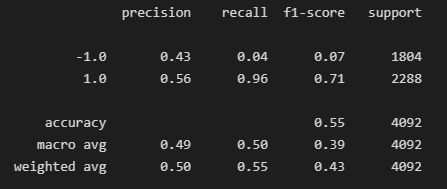
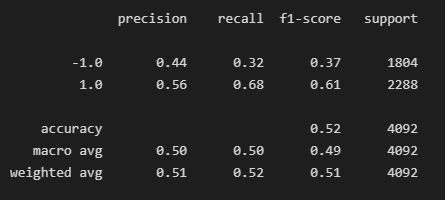
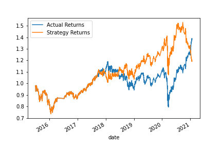

# ML_trading_bot
create an algorithmic trading bot that learns and adapts to new data and evolving markets

## Evaluation Report
The classification report of the SVC model predictions can be found here:

As seen above, this model has a high recall value for the 1 values (.96), but does not perform well in identifying the -1 values.  The precision values are .43 for -1 and .56 for 1, which are not that great.  Even still, it appears our model did better than actuals and would've had higher returns than actuals from mid-2018.  prior to that period, strategy and actual returns were very close.  This model would be preferable for someone with a low risk appetite and would like to see steady gains over time.

## Tuning the Baseline Trading Algorithm
Using LogisticRegression, we have the following classification report:

As seen above, we can see that the precision did not significantly increase for -1 or 1, but we do see an increase in the recall of -1, but at the cost of recall of 1.0.  We also see a slight decrease in accuracy.

looking at the strategy vs actual returns, we find that this model has high volatility with several points where the strategy returns were less than the actual returns, but also large returns in instances where it performed as it should.  This model would be preferable to someone investing with a long time window and isn't afraid of periods of downturn, on the chance for big gains.

## Conclusion
Both models could be further tuned to increase recall, precision and accuracy, but as it stands, the Baseline SVC model would be preferable for a client who has a low risk appetite and wants slow and steady gains over time, but still outperform the stock's actual returns.  The Logisitc Regression model would be preferable for someone who has a higher risk tolerance and would not shy away from downswings for the potential of higher returns.
